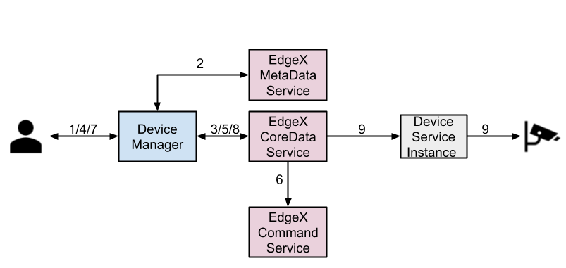

# Managing Edge Devices using EdgeX Foundry

## Table of Contents

- [Managing Edge Devices using EdgeX Foundry](#managing-edge-devices-using-edgex-foundry)
  * [Table of Contents](#table-of-contents)
  * [Glossary](#glossary)
  * [Summary](#summary)
  * [Motivation](#motivation)
    + [Goals](#goals)
    + [Non-Goals/Future Work](#non-goalsfuture-work)
  * [Proposal](#proposal)
    + [User Stories](#user-stories)
    + [Components](#components)
    + [Interaction with EdgeX Foundry](#interaction-with-edgex-foundry)
      - [Setting up EdgeX Foundry](#setting-up-edgex-foundry)
      - [Interaction with EdgeX services](#interaction-with-edgex-services)
  * [Upgrade Strategy](#upgrade-strategy)
  * [Implementation History](#implementation-history)

## Glossary

Refer to the [OpenYurt Glossary](docs/proposals/00_openyurt-glossary.md) and the [EdgeX Foundry Glossary](https://docs.edgexfoundry.org/1.3/general/Definitions/).

## Summary

This proposal introduces an approach to managing IoT devices on OpenYurt using Kubernetes custom resources and EdgeX Foundry. This approach leverages EdgeX Foundry's ability in IoT devices management and uses Kubernetes custom resources to abstract edge devices. As the world's first pluggable IoT platform, EdgeX Foundry has been adopted by most edge device vendors since it was open-sourced. Therefore, the proposed approach inherently supports a rich spectrum of edge devices. On the other hand, we define several custom resource definitions(CRD) that acts as the mediator between OpenYurt and EdgeX Foundry. These CRDs allow users to manage edge devices in a declarative way, which provides users with a Kubernetes-native experience.

## Motivation

Extending the Kubernetes to the edge is not a new topic. However, to support all varieties of edge devices, existing Kubernetes-based edge frameworks have to develop dedicated adaptors for each category of the device from scratch and change the original Kubernetes architecture significantly, which entails great development efforts with the loss of some upstream K8S features. Instead, we are inspired by the Unix philosophy, i.e., “Do one thing, and do it well,” and believe that a mature edge IoT platform should do the device management. To that end, we integrate EdgeX into the OpenYurt, which supports a full spectrum of devices and supports all upstream K8S features.

### Goals

- To design a new custom resource definition(CRD), DeviceProfile, to represent different categories of devices
- To design a new CRD, Device, that represents a physical edge devices
- To design a new CRD, DeviceService, that defines the way of how to connect to a specific device
- To support device management using DeviceProfile, Device, DeviceService and EdgeX Foundry 
- To support automatically setting up of the EdgeX Foundry on the OpenYurt
- To support declartive device state modification, i.e., modifying the device's properties by changing fields of the device CRs

### Non-Goals/Future Work

Non-goals are limited to the scope of this proposal, these features may evolve in the future.

- To implement DeviceService for any specific protocol
- To support data transmission between edge devices and external services
- To support edge data processing   

## Proposal

### User Stories

1. As a vendor, I would like to connect a category of device into the OpenYurt.
2. As an end user, I would like to define how to connect a device, which belongs to a supported DeviceProfile, into the OpenYurt.
3. As an end user, I would like to connect a new device, which belongs to a supported DeviceProfile, into the OpenYurt.
4. As an end user, I would like to modify the states of devices by changing the values of device properties defined in corresponding Device CRs.
5. As an end user, I would like to disconnect a device by deleting the corresponding Device CR.

### Components

#### 1. DeviceProfile

Followings are definitions of DeviceProfile and related Golang structs:

```go
type DeviceProfile struct {
	metav1.TypeMeta   `json:",inline"`
	metav1.ObjectMeta `json:"metadata,omitempty"`

	Spec   DeviceProfileSpec   `json:"spec,omitempty"`
	Status DeviceProfileStatus `json:"status,omitempty"`
}

// DeviceProfileSpec defines the desired state of DeviceProfile
type DeviceProfileSpec struct {
	Description string `json:"description,omitempty"`
	// Manufacturer of the device
	Manufacturer string `json:"manufacturer,omitempty"`
	// Model of the device
	Model string `json:"model,omitempty"`
	// EdgeXLabels used to search for groups of profiles on EdgeX Foundry
	EdgeXLabels     []string         `json:"labels,omitempty"`
	DeviceResources []DeviceResource `json:"deviceResources,omitempty"`

	DeviceCommands []ProfileResource `json:"deviceCommands,omitempty"`
	CoreCommands   []Command         `json:"coreCommands,omitempty"`
}

// DeviceProfileStatus defines the observed state of DeviceProfile
type DeviceProfileStatus struct {
	EdgeXId      string `json:"id,omitempty"`
	AddedToEdgeX bool   `json:"addedToEdgeX,omitempty"`
}

type DeviceResource struct {
	Description string            `json:"description"`
	Name        string            `json:"name"`
	Tag         string            `json:"tag,omitempty"`
	Properties  ProfileProperty   `json:"properties"`
	Attributes  map[string]string `json:"attributes,omitempty"`
}

type ProfileProperty struct {
	Value PropertyValue `json:"value"`
	Units Units         `json:"units,omitempty"`
}

type PropertyValue struct {
    // ValueDescriptor Type of property after transformations
	Type         string `json:"type,omitempty"`         
    // Read/Write Permissions set for this property
	ReadWrite    string `json:"readWrite,omitempty"`    
    // Minimum value that can be get/set from this property
	Minimum      string `json:"minimum,omitempty"`      
    // Maximum value that can be get/set from this property
	Maximum      string `json:"maximum,omitempty"`      
    // Default value set to this property if no argument is passed
	DefaultValue string `json:"defaultValue,omitempty"` 
    // Size of this property in its type  (i.e. bytes for numeric types, characters for string types)
	Size         string `json:"size,omitempty"`         
    // Mask to be applied prior to get/set of property
	Mask         string `json:"mask,omitempty"`         
    // Shift to be applied after masking, prior to get/set of property
	Shift        string `json:"shift,omitempty"`        
    // Multiplicative factor to be applied after shifting, prior to get/set of property
	Scale        string `json:"scale,omitempty"`        
    // Additive factor to be applied after multiplying, prior to get/set of property
	Offset       string `json:"offset,omitempty"`       
    // Base for property to be applied to, leave 0 for no power operation (i.e. base ^ property: 2 ^ 10)
	Base         string `json:"base,omitempty"`         
	// Required value of the property, set for checking error state. Failing an
	// assertion condition will mark the device with an error state
	Assertion     string `json:"assertion,omitempty"`
	Precision     string `json:"precision,omitempty"`
    // FloatEncoding indicates the representation of floating value of reading. It should be 'Base64' or 'eNotation'
	FloatEncoding string `json:"floatEncoding,omitempty"` 
	MediaType     string `json:"mediaType,omitempty"`
}

type Units struct {
	Type         string `json:"type,omitempty"`
	ReadWrite    string `json:"readWrite,omitempty"`
	DefaultValue string `json:"defaultValue,omitempty"`
}

type ProfileResource struct {
	Name string              `json:"name,omitempty"`
	Get  []ResourceOperation `json:"get,omitempty"`
	Set  []ResourceOperation `json:"set,omitempty"`
}

type ResourceOperation struct {
	Index     string `json:"index,omitempty"`
	Operation string `json:"operation,omitempty"`
	// Deprecated
	Object string `json:"object,omitempty"`
	// The replacement of Object field
	DeviceResource string `json:"deviceResource,omitempty"`
	Parameter      string `json:"parameter,omitempty"`
	// Deprecated
	Resource string `json:"resource,omitempty"`
	// The replacement of Resource field
	DeviceCommand string            `json:"deviceCommand,omitempty"`
	Secondary     []string          `json:"secondary,omitempty"`
	Mappings      map[string]string `json:"mappings,omitempty"`
}

type Command struct {
	// EdgeXId is a unique identifier used by EdgeX Foundry, such as a UUID
	EdgeXId string `json:"id,omitempty"`
	// Command name (unique on the profile)
	Name string `json:"name,omitempty"`
	// Get Command
	Get Get `json:"get,omitempty"`
	// Put Command
	Put Put `json:"put,omitempty"`
}

type Put struct {
	Action         `json:",inline"`
	ParameterNames []string `json:"parameterNames,omitempty"`
}

type Get struct {
	Action `json:",omitempty"`
}

type Action struct {
	// Path used by service for action on a device or sensor
	Path string `json:"path,omitempty"`
	// Responses from get or put requests to service
	Responses []Response `json:"responses,omitempty"`
	// Url for requests from command service
	URL string `json:"url,omitempty"`
}

// Response for a Get or Put request to a service
type Response struct {
	Code           string   `json:"code,omitempty"`
	Description    string   `json:"description,omitempty"`
	ExpectedValues []string `json:"expectedValues,omitempty"`
}

```
#### 2. Device

Followings are definitions of Device and related Golang structs:

```go
// Device is the Schema for the devices API
type Device struct {
	metav1.TypeMeta   `json:",inline"`
	metav1.ObjectMeta `json:"metadata,omitempty"`

	Spec   DeviceSpec   `json:"spec,omitempty"`
	Status DeviceStatus `json:"status,omitempty"`
}

// DeviceSpec defines the desired state of Device
type DeviceSpec struct {
	Description string `json:"description,omitempty"`
	// Admin state (locked/unlocked)
	AdminState AdminState `json:"adminState,omitempty"`
	// Operating state (enabled/disabled)
	OperatingState OperatingState `json:"operatingState,omitempty"`
	// A map of supported protocols for the given device
	Protocols map[string]ProtocolProperties `json:"protocols,omitempty"`
	// Other labels applied to the device to help with searching
	Labels []string `json:"labels,omitempty"`
	// Device service specific location (interface{} is an empty interface so
	// it can be anything)
	Location string `json:"location,omitempty"`
	// Associated Device Service - One per device
	Service string `json:"service"`
	// Associated Device Profile - Describes the device
	Profile string `json:"profile"`
	// TODO support the following field
	// A list of auto-generated events coming from the device
	// AutoEvents     []AutoEvent                   `json:"autoEvents"`
	DeviceProperties map[string]DesiredPropertyState `json:"deviceProperties,omitempty"`
}

type DesiredPropertyState struct {
	Name         string `json:"name"`
	PutURL       string `json:"putURL,omitempty"`
	DesiredValue string `json:"desiredValue"`
}

type ActualPropertyState struct {
	Name        string `json:"name"`
	GetURL      string `json:"getURL,omitempty"`
	ActualValue string `json:"actualValue"`
}

// DeviceStatus defines the observed state of Device
type DeviceStatus struct {
	// Time (milliseconds) that the device last provided any feedback or
	// responded to any request
	LastConnected int64 `json:"lastConnected,omitempty"`
	// Time (milliseconds) that the device reported data to the core
	// microservice
	LastReported int64 `json:"lastReported,omitempty"`
	// AddedToEdgeX indicates whether the object has been successfully
	// created on EdgeX Foundry
	AddedToEdgeX     bool                           `json:"addedToEdgeX,omitempty"`
	DeviceProperties map[string]ActualPropertyState `json:"deviceProperties,omitempty"`
	Id               string                         `json:"id,omitempty"`
}

type AdminState string

const (
	Locked   AdminState = "LOCKED"
	UnLocked AdminState = "UNLOCKED"
)

type OperatingState string

const (
	Enabled  OperatingState = "ENABLED"
	Disabled OperatingState = "DISABLED"
)

type ProtocolProperties map[string]string

```

#### 3. DeviceService

Followings are definitions of DeviceService and related Golang structs

```go
// DeviceService is the Schema for the deviceservices API
type DeviceService struct {
	metav1.TypeMeta   `json:",inline"`
	metav1.ObjectMeta `json:"metadata,omitempty"`

	Spec   DeviceServiceSpec   `json:"spec,omitempty"`
	Status DeviceServiceStatus `json:"status,omitempty"`
}

// DeviceServiceSpec defines the desired state of DeviceService
type DeviceServiceSpec struct {
	Description string `json:"description,omitempty"`
	// EdgeXLabels are used by EdgeX Foundry for locating/grouping device services
	EdgeXLabels []string `json:"labels,omitempty"`
	// address (MQTT topic, HTTP address, serial bus, etc.) for reaching the service
	Addressable Addressable `json:"addressable,omitempty"`
}

// DeviceServiceStatus defines the observed state of DeviceService
type DeviceServiceStatus struct {
    // the Id assigned by the EdgeX foundry
	EdgeXId string `json:"id,omitempty"`
	AddedToEdgeX bool `json:"addedToEdgeX,omitempty"`
    LastConnected int64 `json:"lastConnected,omitempty"`
	// time in milliseconds that the device last reported data to the core
	LastReported int64 `json:"lastReported,omitempty"`
    // operational state - either enabled or disabled
	OperatingState OperatingState `json:"operatingState,omitempty"`
    // Device Service Admin State
	AdminState AdminState `json:"adminState,omitempty"`
}

type Addressable struct {
	// ID is a unique identifier for the Addressable, such as a UUID
	Id string `json:"id,omitempty"`
	// Name is a unique name given to the Addressable
	Name string `json:"name,omitempty"`
	// Protocol for the address (HTTP/TCP)
	Protocol string `json:"protocol,omitempty"`
	// Method for connecting (i.e. POST)
	HTTPMethod string `json:"method,omitempty"`
	// Address of the addressable
	Address string `json:"address,omitempty"`
	// Port for the address
	Port int `json:"port,omitempty"`
	// Path for callbacks
	Path string `json:"path,omitempty"`
	// For message bus protocols
	Publisher string `json:"publisher,omitempty"`
	// User id for authentication
	User string `json:"user,omitempty"`
	// Password of the user for authentication for the addressable
	Password string `json:"password,omitempty"`
	// Topic for message bus addressables
	Topic string `json:"topic,omitempty"`
}
```

### Interaction with EdgeX Foundry 

#### 1. Setting up EdgeX Foundry

As OpenYurt supports all upstream Kubernetes features, the deployment of the EdgeX Foundry should be same as deploying it on the Kubernetes. The Deployment yaml files can be found in the [EdgeX Foundry example repository](https://github.com/edgexfoundry/edgex-examples/tree/master/deployment/kubernetes), by simply applying them, the necessary services will be deployed. In addition, we will also allow users to choose if they want to setup the EdgeX Foundry automacially when converting the Kubernetes cluster to the OpenYurt cluster using the `yurtctl` command-line tool. 


#### 2. CRUD objects on EdgeX Foundry

To conciliate the device states between OpenYurt and EdgeX Foundry, a new component, DeviceManager, will be installed on the OpenYurt. The DeviceManager includes three controllers, i.e., DeviceProfile Controller, DeviceService Controller, and the Device Controller, which act as mediators between the OpenYurt and the EdgeX Fundry and are responsible for reconciling the states of the device related custom resources with the states of the corresponding objects on the EdgeX Foundry.

Following is the process of connecting a new device to the OpenYurt through EdgeX Foundry.



1. The vendor apply the DeviceProfile CR.
2. The DeviceManager create the related ValueDescriptor on the EdgeX MetaData Service.
3. The DeviceManager create the DeviceProfile on the EdgeX CoreData Service.
4. The end user apply the Device CR.
5. The DeviceManager create the Device object on the EdgeX CoreData Service.
6. The Device supported commands are created on the EdgeX Command Service.
7. The end user apply the DeviceService CR.
8. The DeviceManager creates the DeviceService object on the EdgeX CoreData Service.
9. The Physical Device is connected to the OpenYurt through the device service instance (The actual micro service that talks to the physical devices, depends on what protocol the device uses, the device service instance may be deployed as pod on edge nodes or be deployed outside of the OpenYurt cluster).

#### 3. Enabling the device properties 

### System Architecture

## Upgrade Strategy

In the first implementation, we will support the EdgeX Foundry [Hanoi](), and would not support upgrading/downgrading to other versions.

## Implementation History

- [ ] 03/15/2021: Proposed idea in an issue or [community meeting](https://us02web.zoom.us/j/82828315928?pwd=SVVxek01T2Z0SVYraktCcDV4RmZlUT09)
- [ ] MM/DD/YYYY: First round of feedback from community
- [ ] MM/DD/YYYY: Present proposal at a [community meeting](https://us02web.zoom.us/j/82828315928?pwd=SVVxek01T2Z0SVYraktCcDV4RmZlUT09)
- [ ] MM/DD/YYYY: Open proposal PR


